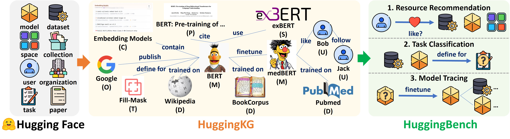

<h1 align="center">
    Benchmarking Recommendation, Classification, and Tracing Based on Hugging Face Knowledge Graph
</h1>

<p align="center">
  <a href='https://arxiv.org/abs/2505.17507'>
    
  </a> &nbsp;&nbsp;&nbsp;&nbsp;&nbsp;

  <a href="https://huggingface.co/collections/cqsss/huggingbench-67b2ee02ca45b15e351009a2">
    
  </a> &nbsp;&nbsp;&nbsp;&nbsp;&nbsp;

  <a href="https://sigir.org/sigir2025/">
    
  </a> &nbsp;&nbsp;&nbsp;&nbsp;&nbsp;

  <a href="https://opensource.org/license/apache-2-0">
    
  </a>
</p>



This repository provides the code and data for the paper **"Benchmarking Recommendation, Classification, and Tracing Based on Hugging Face Knowledge Graph"**.


## 📰 News

[2025-04-05] Our resource paper on HuggingKG and HuggingBench has been accepted at **SIGIR 2025**! 🎉🎉🎉


## 🔗 Data

The **HuggingKG** knowledge graph and **HuggingBench** benchmark are available on the [Hugging Face](https://huggingface.co/collections/cqsss/huggingbench-67b2ee02ca45b15e351009a2).

### 🧠 [HuggingKG](https://huggingface.co/datasets/cqsss/HuggingKG)

- `triples.txt`: The full set of graph triples in the format:

```
JeffreyXiang/TRELLIS	space_use_model	JeffreyXiang/TRELLIS-image-large
black-forest-labs/FLUX.1-dev	space_use_model	black-forest-labs/FLUX.1-dev
black-forest-labs/FLUX.1-dev	space_use_model	madebyollin/taef1
Changg/ori	model_definedFor_task	text-to-image
DmitryYarov/aristotle_based_on_rugpt3large_based_on_gpt	model_definedFor_task	text-generation
JINJIN7987/llama3-8b-neg-sleeper	model_definedFor_task	text-generation
ShuhongZheng/sdxl_cat2_w_preserve	model_definedFor_task	text-to-image
```

- `HuggingKG_V20241215174821.zip`: A zip archive containing JSON files with detailed node and edge attributes. Each JSON file is a list of dict.

### 📊 HuggingBench

#### 🔁 [Resource Recommendation](https://huggingface.co/datasets/cqsss/HuggingBench-Recommendation)

- `general_rec`: Includes train/val/test splits formatted for [SSLRec](https://github.com/HKUDS/SSLRec)
- `social_rec`: Includes user social relations and splits for social recommendation
- `ke_rec_xxx`: Includes knowledge-enhanced splits using HuggingKG triples as external knowledge graphs

#### 🏷️ [Task Classification](https://huggingface.co/datasets/cqsss/HuggingBench-Classification)

- `classification.zip`: Multilabel train/val/test files with task-to-ID mappings
- `huggingface_xxx.pt`: Graph data formatted for [CogDL](https://github.com/THUDM/CogDL)

#### 🔍 [Model Tracing](https://huggingface.co/datasets/cqsss/HuggingBench-Tracing)

- `training.txt`, `validation.txt`, `test.txt`: Formatted for [LibKGE](https://github.com/uma-pi1/kge)


## 🧾 HuggingKG Construction

HuggingKG is a comprehensive knowledge graph constructed from Hugging Face, capturing rich connections between models, datasets, papers, users, and other resources.

The code for constructing HuggingKG is available in the [HuggingKG](HuggingKG) directory, including:
- `HuggingKG_constructor.py`: The main script for crawling data and building the knowledge graph
- `requirements.txt`: Required Python packages for running the constructor
- `README.md`: Detailed documentation about the construction process and statistics

For detailed information about the construction process and statistics of HuggingKG, please refer to the [HuggingKG/README.md](HuggingKG/README.md).


## 🧪 Experiments

### 🔁 Resource Recommendation

Implemented using [SSLRec](https://github.com/HKUDS/SSLRec).

#### Setup:
1. Clone `SSLRec` and install requirements.
2. Place HuggingBench data in `SSLRec/datasets`.
3. Copy config files from `./resource_recommendation/SSLRec/config`.
4. Run the provided scripts in `./resource_recommendation/SSLRec/scripts`.

- **General Collaborative Filtering**

|          | Recall@5 | Recall@10 | Recall@20 | Recall@40 | NDCG@5  | NDCG@10 | NDCG@20 | NDCG@40 |
|----------|----------|-----------|-----------|-----------|---------|---------|---------|---------|
| LightGCN | 0.0856   | 0.1301    | 0.1932    | 0.2759    | 0.0868  | 0.1003  | 0.1192  | 0.1413  |
| HCCF     | 0.0834   | 0.1254    | 0.1820    | 0.2504    | 0.0847  | 0.0975  | 0.1143  | 0.1328  |
| SimGCL   | 0.0999   | 0.1515    | 0.2186    | 0.3010    | 0.0998  | 0.1158  | 0.1358  | 0.1581  |
| LightGCL | 0.1033   | 0.1558    | 0.2228    | 0.3017    | 0.1035  | 0.1198  | 0.1398  | 0.1611  |
| AutoCF   | 0.1003   | 0.1530    | 0.2190    | 0.3039    | 0.1012  | 0.1174  | 0.1371  | 0.1598  |
| DCCF     | 0.0985   | 0.1493    | 0.2167    | 0.3003    | 0.0983  | 0.1142  | 0.1343  | 0.1567  |


- **Social Recommendation**

|      | Recall@5 | Recall@10 | Recall@20 | Recall@40 | NDCG@5  | NDCG@10 | NDCG@20 | NDCG@40 |
|------|----------|-----------|-----------|-----------|---------|---------|---------|---------|
| MHCN | 0.0979  | 0.1490  | 0.2162  | 0.3007  | 0.0998  | 0.1154  | 0.1353  | 0.1579  |
| DSL  | 0.0932  | 0.1425  | 0.2123  | 0.2986  | 0.0948  | 0.1099  | 0.1307  | 0.1538  |


- **KG-Based Recommendation**

|               | Recall@5 | Recall@10 | Recall@20 | Recall@40 | NDCG@5  | NDCG@10 | NDCG@20 | NDCG@40 |
|---------------|----------|-----------|-----------|-----------|---------|---------|---------|---------|
| KGIN-2hop     | 0.0002  | 0.0004  | 0.0008  | 0.0016  | 0.0003  | 0.0004  | 0.0005  | 0.0007  |
| KGCL-2hop     | 0.1007  | 0.1510  | 0.2165  | 0.2959  | 0.1016  | 0.1170  | 0.1364  | 0.1579  |
| KGRec-2hop    | 0.0597  | 0.0941  | 0.1423  | 0.2122  | 0.0625  | 0.0729  | 0.0872  | 0.1057  |
| KGIN-1hop     | 0.0001  | 0.0004  | 0.0010  | 0.0017  | 0.0002  | 0.0003  | 0.0005  | 0.0007  |
| KGCL-1hop     | 0.0993  | 0.1490  | 0.2135  | 0.2918  | 0.1009  | 0.1160  | 0.1351  | 0.1563  |
| KGRec-1hop    | 0.0558  | 0.0897  | 0.1395  | 0.2076  | 0.0575  | 0.0681  | 0.0832  | 0.1014  |
| KGIN-homo     | 0.0061  | 0.0096  | 0.0146  | 0.0219  | 0.0065  | 0.0076  | 0.0091  | 0.0111  |
| KGCL-homo     | 0.1054  | 0.1578  | 0.2237  | 0.3059  | 0.1058  | 0.1220  | 0.1416  | 0.1637  |
| KGRec-homo    | 0.0628  | 0.0985  | 0.1476  | 0.2106  | 0.0638  | 0.0751  | 0.0898  | 0.1067  |
| KGIN-publish  | 0.0002  | 0.0003  | 0.0007  | 0.0016  | 0.0002  | 0.0003  | 0.0004  | 0.0007  |
| KGCL-publish  | 0.1036  | 0.1543  | 0.2205  | 0.3011  | 0.1038  | 0.1195  | 0.1392  | 0.1609  |
| KGRec-publish | 0.0609  | 0.0941  | 0.1385  | 0.2002  | 0.0636  | 0.0734  | 0.0863  | 0.1027  |


### 🏷️  Task Classification

Implemented using [CogDL](https://github.com/THUDM/CogDL).

#### Setup:
1. Clone `CogDL` and install requirements.
2. Download data in [HuggingBench-Classification](https://huggingface.co/datasets/cqsss/HuggingBench-Classification) to `task_classification/data/`.
3. Run `./task_classification/tune_huggingface.py`.

|            | binary  | BERT    | BERT (ft) | BGE     | BGE (ft)  |
|------------|---------|---------|---------|---------|---------|
| GCN        | 0.0662  | 0.7620  | 0.8291  | 0.7411  | 0.8522  |
| GAT        | 0.0390  | 0.5105  | 0.8125  | 0.5444  | 0.8261  |
| GRAND      | 0.1228  | 0.1297  | 0.6089  | 0.2646  | 0.4532  |
| GraphSAGE  | 0.1800  | 0.5341  | 0.8845  | 0.8199  | 0.8830  |
| ANNPN      | 0.0448  | 0.7297  | 0.8304  | 0.7571  | 0.8419  |
| GCNII      | 0.1149  | 0.6456  | 0.8836  | 0.7779  | 0.8802  |
| GraphSAINT | 0.0579  | 0.2703  | 0.8342  | 0.0540  | 0.8251  |
| RevGCN     | 0.1071  | 0.6763  | 0.8851  | 0.8039  | 0.8770  |
| RevGAT     | 0.0335  | 0.7412  | 0.8849  | 0.7569  | 0.8716  |


### 🔍 Model Tracing


Implemented using [LibKGE](https://github.com/uma-pi1/kge) for supervised biselines and the official code of [ULTRA](https://github.com/DeepGraphLearning/ULTRA) and [KG-ICL](https://github.com/nju-websoft/KG-ICL) for the two unsupervised models.

#### Setup:
1. Clone `LibKGE` and install requirements.
2. Download data in [HuggingBench-Tracing](https://huggingface.co/datasets/cqsss/HuggingBench-Tracing) to `kge/data/huggingface`.
3. Copy configuration files in `./model_tracing/kge/examples`.
4. Run train/test shell scripts `model_tracing\kge\scripts\train.sh` and `model_tracing\kge\scripts\test.sh`.

|          | MRR     | HIT@1   | HIT@3   | HIT@5   | HIT@10  |
|----------|---------|---------|---------|---------|---------|
| RESCAL   | 0.2694  | 0.2380  | 0.2667  | 0.2929  | 0.3470  |
| TransE   | 0.5589  | 0.4496  | 0.6321  | 0.6973  | 0.7562  |
| DistMult | 0.2050  | 0.1421  | 0.2321  | 0.2735  | 0.3324  |
| ComplEx  | 0.1807  | 0.1109  | 0.2122  | 0.2599  | 0.3066  |
| ConvE    | 0.4739  | 0.3766  | 0.5119  | 0.5903  | 0.6735  |
| RotatE   | 0.5317  | 0.4195  | 0.6029  | 0.6803  | 0.7392  |
| HittER   | 0.3678  | 0.2900  | 0.4078  | 0.4657  | 0.5314  |
| ULTRA    | 0.3373  | 0.1440  | 0.4803  | 0.5309  | 0.6672  |
| KG-ICL   | 0.4008  | 0.3354  | 0.3792  | 0.4854  | 0.5938  |


## 📄 Citation

```bibtex
@inproceedings{chen2025huggingbench,
  title = {Benchmarking Recommendation, Classification, and Tracing Based on Hugging Face Knowledge Graph},
  author = {Chen, Qiaosheng and Huang, Kaijia and Zhou, Xiao and Luo, Weiqing and Cui, Yuanning and Cheng, Gong},
  booktitle = {Proceedings of the 48th International ACM SIGIR Conference on Research and Development in Information Retrieval},
  year = {2025},
  publisher = {ACM}
}
```
