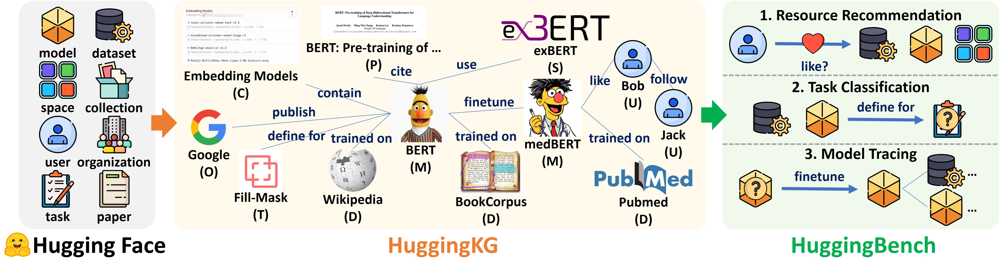

# 工作

对 Hugging Face 构建知识图谱：
- 构建 AI 场景的要素，涉及模型（model ）、数据集（dataset ）、空间（space ，可理解为模型部署 / 展示环境 ）、集合（collection ，数据或模型的集合归类 ）、用户（user ）、组织（organization ）、任务（task ）、论文（paper ），是整个流程的 “输入” 。
- 梳理模型、数据、用户、机构等之间的复杂关联，让各要素关系更清晰：
    - 模型与数据：像 BERT（经典预训练模型 ）在 Wikipedia 数据集上训练（trained on ），medBERT 在 BookCorpus、PubMed 等数据上训练，体现模型训练的数据依赖；Embedding Models（嵌入模型 ）由 Google 等发布（publish ）、定义（define for ），BERT 会被论文引用（cite ） 。
    - 用户与模型：用户（如 Bob、Jack ）会有 “like（喜好 ）”“follow（关注 ）” 模型的行为，模型也可被用户微调（finetune ），体现人与模型的交互 。
知识图谱的应用功能，辅助资源利用、任务处理和模型管理。
- Resource Recommendation（资源推荐）：依据用户 “like（喜好 ）” 等行为，从数据库等资源里，给用户推荐模型、数据集等资源 。
- Task Classification（任务分类）：基于数据、模型，为任务（如具体 NLP 任务 ）做定义、分类，匹配合适工具。
- Model Tracing（模型溯源）：通过 “finetune（微调 ）” 等行为，追踪模型的迭代、衍生关系（比如一个模型微调后产生新模型，可追溯 lineage ）。




# 文件目录结构

```plaintext
HuggingBench/
├── LICENSE                   # 项目使用的 Apache 2.0 许可证文件
├── README.md                 # 项目的主说明文件，包含项目概述、数据链接、实验步骤等信息
├── figs/                     # 存放项目相关的图片，如 HuggingKG 图表
│   └── huggingkg.jpg         # HuggingKG 的图表文件
├── HuggingKG/                # 用于构建 HuggingKG 知识图谱的代码和文档
│   ├── HuggingKG_constructor.py  # 用于从 Hugging Face 爬取数据并构建知识图谱的主脚本
│   ├── requirements.txt      # 运行构建脚本所需的 Python 包列表
│   └── README.md             # 详细的构建过程和统计信息文档
├── resource_recommendation/  # 资源推荐任务相关代码
│   └── SSLRec/
│       ├── config/           # 配置文件目录
│       │   ├── configurator.py   # 解析命令行参数和 YAML 配置文件的脚本
│       │   └── modelconf/    # 模型配置文件目录
│       │       ├── bert4rec.yml    # BERT4Rec 模型的配置文件
│       │       ├── dccf.yml        # DCCF 模型的配置文件
│       │       ├── gformer.yml     # GFormer 模型的配置文件
│       │       ├── hccf.yml        # HCCF 模型的配置文件
│       │       ├── hmgcr.yml       # HMGCR 模型的配置文件
│       │       ├── lightgcl.yml    # LightGCL 模型的配置文件
│       │       ├── lightgcn.yml    # LightGCN 模型的配置文件
│       │       └── directau.yml    # DirectAU 模型的配置文件
│       ├── data_utils/       # 数据处理工具目录
│       │   ├── datasets_diff.py          # 差异数据集处理类
│       │   ├── datasets_general_cf.py    # 通用协同过滤数据集处理类
│       │   ├── datasets_sequential.py    # 序列数据集处理类
│       │   ├── datasets_multi_behavior.py# 多行为数据集处理类
│       │   ├── data_handler_sequential.py# 序列数据处理类
│       │   ├── data_handler_multi_behavior.py # 多行为数据处理类
│       │   ├── data_handler_kg.py        # 知识图谱数据处理类
│       │   ├── data_handler_social.py    # 社交数据处理类
│       │   ├── data_handler_general_cf.py# 通用协同过滤数据处理类
│       │   ├── build_data_handler.py     # 根据配置动态创建数据处理类实例的脚本
│       │   └── __init__.py       # 包初始化文件
│       └── scripts/        # 实验脚本目录
│           ├── run_general_cf.sh    # 运行通用协同过滤 collaborative filtering 实验的脚本 
│           ├── run_social_rec.sh    # 运行社交推荐 social recommendation 实验的脚本
│           ├── run_kg_based_rec.sh  # 运行基于知识图谱推荐 HuggingKG recommendation 实验的脚本
├── task_classification/      # 任务分类任务相关代码
│   └── tune_huggingface.py   # 任务分类实验的调优脚本
└── model_tracing/            # 模型追踪任务相关代码
    ├── kge/
    │   ├── scripts/
    │   │   ├── train.sh      # 模型训练脚本
    │   │   └── test.sh       # 模型测试脚本
    │   └── examples/
    │       ├── huggingface-train-complex.yaml    # Complex 模型训练配置文件
    │       ├── huggingface-train-rotate.yaml     # Rotate 模型训练配置文件
    │       ├── huggingface-train-transe.yaml     # TransE 模型训练配置文件
    │       └── huggingface-train-transformer.yaml# Transformer 模型训练配置文件
```


### 主要任务
该项目围绕Hugging Face知识图谱开展了资源推荐、任务分类和模型追踪三个主要任务的基准测试，了解各个模型在不同指标下的性能表现，从而为模型的选择和优化提供参考依据。 

### 具体操作及结果

#### 1. HuggingKG知识图谱构建
- **操作**：使用`HuggingKG_constructor.py`脚本从Hugging Face爬取数据并构建知识图谱。脚本中使用了多线程加速数据处理，通过`run`方法顺序执行数据收集、验证和存储操作。具体的数据来源和处理方式如下：
    - **实体**：从不同的API端点和数据标签中获取任务、模型、数据集、空间、集合、论文、用户和组织等实体信息。
    - **关系**：根据模型、数据集等数据中的标签信息，提取模型与任务、模型与模型、模型与数据集等之间的关系。
- **结果**：构建了一个名为HuggingKG的综合知识图谱，包含丰富的节点和边信息。知识图谱的数据以JSON文件的形式存储，包括实体数据、关系数据和额外的ID集合数据。可在 [Hugging Face](https://huggingface.co/datasets/cqsss/HuggingKG) 上获取，其中`triples.txt`包含图三元组集合，`HuggingKG_V20241215174821.zip`包含详细节点和边属性的JSON文件。

```plaintext
# triples.txt

# 节点 ->边-> 节点
# JeffreyXiang/TRELLIS空间 使用了 JeffreyXiang/TRELLIS-image-large模型
JeffreyXiang/TRELLIS space_use_model JeffreyXiang/TRELLIS-image-large

# Changg/ori 模型 用于 “文本到图像” 任务
Changg/ori model_definedFor_task text-to-image

```
---
图中边的表示：COO格式
- 第二行：目标节点 ID（终止节点）
- 每一列：表示一条有向边 (源节点 → 目标节点)
- 第一行：源节点 ID（起始节点）
`edge_index = torch.tensor([[0, 1, 1, 2], [1, 0, 2, 1]], dtype=torch.long)
`
边索引的四列
边1: [0, 1] → 表示边 0 → 1
边2: [1, 0] → 表示边 1 → 0
边3: [1, 2] → 表示边 1 → 2
边4: [2, 1] → 表示边 2 → 1
最终可以表达成：`节点0 ⇄ 节点1 ⇄ 节点2`
---
对于有向图，邻接表中的每个元素表示：节点 i → 从 i 出发的所有目标节点列表
```python
# 有向图的邻接表表示（Python字典）
adj_list = {
    0: [1],       # 节点0有一条出边：0→1
    1: [0, 2],    # 节点1有两条出边：1→0 和 1→2
    2: [1]        # 节点2有一条出边：2→1
}
```

#### 2. 资源推荐
- **操作**：使用 [SSLRec](https://github.com/HKUDS/SSLRec) 实现资源推荐任务。具体步骤如下：
    1. 克隆`SSLRec`并安装依赖。
    2. 将[HuggingBench-Recommendation](https://huggingface.co/datasets/cqsss/HuggingBench-Recommendation)数据放置在SSLRec 的 `SSLRec/datasets`目录下。
    3. 复制配置文件`./resource_recommendation/SSLRec/config` 和 `./resource_recommendation/SSLRec/data_utils`。
    4. 运行`./resource_recommendation/SSLRec/scripts`中的脚本。

- **结果**：在通用协同过滤、社交推荐和基于知识图谱的推荐任务上，评估了多种算法（如LightGCN、HCCF、SimGCL等）的性能，记录了不同算法在Recall和NDCG指标下的表现。

测试指标
 - **Recall@k**：召回率，指在真实相关的项目中，被模型推荐到前 `k` 个位置的项目比例。例如，`Recall@5` 表示真实相关的项目中，有多少比例被模型推荐到了前 5 个位置。该指标值越高，说明模型能召回更多相关的项目。
 - **NDCG@k（Normalized Discounted Cumulative Gain）**：归一化折损累积增益，综合考虑了推荐结果的相关性和排名顺序，数值越高表示推荐结果越相关且排名越合理。

以“General Collaborative Filtering 通用协同过滤”部分为例：
|  | Recall@5 | Recall@10 | Recall@20 | Recall@40 | NDCG@5 | NDCG@10 | NDCG@20 | NDCG@40 |
|--|--|--|--|--|--|--|--|--|
| LightGCN | 0.0856 | 0.1301 | 0.1932 | 0.2759 | 0.0868 | 0.1003 | 0.1192 | 0.1413 |
| HCCF | 0.0834 | 0.1254 | 0.1820 | 0.2504 | 0.0847 | 0.0975 | 0.1143 | 0.1328 |
| SimGCL | 0.0999 | 0.1515 | 0.2186 | 0.3010 | 0.0998 | 0.1158 | 0.1358 | 0.1581 |
| LightGCL | 0.1033 | 0.1558 | 0.2228 | 0.3017 | 0.1035 | 0.1198 | 0.1398 | 0.1611 |
| AutoCF | 0.1003 | 0.1530 | 0.2190 | 0.3039 | 0.1012 | 0.1174 | 0.1371 | 0.1598 |
| DCCF | 0.0985 | 0.1493 | 0.2167 | 0.3003 | 0.0983 | 0.1142 | 0.1343 | 0.1567 |

从表格数据可以看出，`LightGCL` 模型在 `Recall@k` 和 `NDCG@k` 指标上的表现相对较好，说明该模型在召回相关项目和提供合理推荐排名方面具有优势。而 `HCCF` 模型的各项指标值相对较低，性能相对较弱。

#### 3. 任务分类
- **操作**：使用 [CogDL](https://github.com/THUDM/CogDL) 对图神经网络模型进行**超参数调优**，以完成节点分类任务。具体步骤如下：
    1. 克隆`CogDL`并安装依赖。
    2. 下载 [HuggingBench-Classification](https://huggingface.co/datasets/cqsss/HuggingBench-Classification) 数据到`task_classification/data/`目录。
        - classification.zip：为多标签分类任务提供标准的训练、验证和测试数据。
        - huggingface_xxx.pt：提供图结构数据，并且节点特征是通过 Hugging Face 预训练模型初始化的。
    3. 运行`./task_classification/tune_huggingface.py`。
- **结果**：评估了多种图神经网络模型（如GCN、GAT、GRAND等）在任务分类任务上的性能，记录了不同模型在不同特征表示（如binary、BERT、BGE等）下的表现。


每一行代表一个不同的图神经网络模型，这些模型被用于任务分类任务，具体解释如下：
- **GCN（Graph Convolutional Network）**：图卷积网络，是一种经典的图神经网络，通过聚合节点的邻域信息来学习节点的表示。
- **GAT（Graph Attention Network）**：图注意力网络，引入了注意力机制，能够自适应地为不同邻域节点分配不同的权重。
- **GRAND（Graph Random Neural Network）**：一种基于随机游走的图神经网络，通过随机采样和聚合邻域信息来学习节点表示。
- **GraphSAGE（Graph Sample and Aggregate）**：图采样与聚合网络，通过采样和聚合邻域节点的信息来学习节点表示，适用于大规模图数据。
- **ANNPN（Adaptive Neural Network Propagation Network）**：自适应神经网络传播网络，可能是一种自定义的图神经网络模型，用于处理特定的图数据和任务。
- **GCNII（Graph Convolutional Network II）**：可能是 GCN 的改进版本，通过引入额外的层和机制来提高模型的性能。
- **GraphSAINT（Graph Sampling Based Inductive Learning Method）**：基于图采样的归纳学习方法，通过采样子图来训练模型，适用于大规模图数据。
- **RevGCN（Reversible Graph Convolutional Network）**：可逆图卷积网络，引入了可逆模块，能够减少内存消耗和提高训练效率。
- **RevGAT（Reversible Graph Attention Network）**：可逆图注意力网络，结合了可逆模块和注意力机制，用于处理图数据。

每一列代表一种不同的特征表示方法，用于为模型提供输入数据，具体解释如下：
每个节点都需要有初始特征向量。常见的初始化方式有随机初始化、基于节点属性的初始化，还有利用预训练模型生成特征（本项目）等。
- **binary**：二进制特征表示，可能是将数据转换为二进制向量作为输入。
- **BERT**：使用预训练的 BERT 模型提取的特征，BERT 是一种基于 Transformer 的预训练语言模型，能够学习到丰富的语义信息。
- **BERT (ft)**：在预训练的 BERT 模型基础上进行微调（fine-tuning）后提取的特征，微调可以使模型更好地适应特定的任务。
- **BGE**：可能是一种自定义的特征提取方法，用于提取图数据的特征。“Bidirectional Graph Embedding” 双向图嵌入
- **BGE (ft)**：在 BGE 特征提取方法的基础上进行微调后提取的特征。 “fine-tuned”（微调）

|            | binary  | BERT    | BERT (ft) | BGE     | BGE (ft)  |
|------------|---------|---------|---------|---------|---------|
| GCN        | 0.0662  | 0.7620  | 0.8291  | 0.7411  | 0.8522  |
| GAT        | 0.0390  | 0.5105  | 0.8125  | 0.5444  | 0.8261  |
| GRAND      | 0.1228  | 0.1297  | 0.6089  | 0.2646  | 0.4532  |
| GraphSAGE  | 0.1800  | 0.5341  | 0.8845  | 0.8199  | 0.8830  |
| ANNPN      | 0.0448  | 0.7297  | 0.8304  | 0.7571  | 0.8419  |
| GCNII      | 0.1149  | 0.6456  | 0.8836  | 0.7779  | 0.8802  |
| GraphSAINT | 0.0579  | 0.2703  | 0.8342  | 0.0540  | 0.8251  |
| RevGCN     | 0.1071  | 0.6763  | 0.8851  | 0.8039  | 0.8770  |
| RevGAT     | 0.0335  | 0.7412  | 0.8849  | 0.7569  | 0.8716  |

从表格数据可知，`GraphSAGE` 模型在 `BERT (ft)` 和 `BGE` 特征表示下的分类准确率较高，说明该模型在这两种特征下的分类性能较好。而 `GRAND` 模型在部分特征表示下的准确率较低，性能相对较差。


#### 4. 模型溯源
- **操作**：使用 [LibKGE](https://github.com/uma-pi1/kge) 知识图嵌入（Knowledge Graph Embedding，KGE）实现有监督基线；使用 [ULTRA](https://github.com/DeepGraphLearning/ULTRA) 和 [KG-ICL](https://github.com/nju-websoft/KG-ICL) 的官方代码实现两个无监督模型。具体步骤如下：
    1. 克隆`LibKGE`并安装依赖。
    2. 下载 [HuggingBench-Tracing](https://huggingface.co/datasets/cqsss/HuggingBench-Tracing) 数据到`kge/data/huggingface`。
    3. 复制配置文件`./model_tracing/kge/examples`。
    4. 运行训练/测试脚本`model_tracing\kge\scripts\train.sh`和`model_tracing\kge\scripts\test.sh`。
- **结果**：评估了多种模型（如RESCAL、TransE、DistMult等）在模型追踪任务上的性能，记录了不同模型在MRR和HIT@k指标下的表现。


测试指标
 - **MRR（Mean Reciprocal Rank）**：平均倒数排名，反映了模型预测结果中正确答案的排名情况，数值越高表明模型预测的结果越靠前，性能越好。
 - **HIT@k**：指在模型预测的前 `k` 个结果中，包含正确答案的比例。例如，`HIT@1` 表示第一个预测结果就是正确答案的比例，`HIT@3` 表示前三个预测结果中包含正确答案的比例，以此类推。该指标值越高，说明模型的命中率越高。


|  | MRR | HIT@1 | HIT@3 | HIT@5 | HIT@10 |
|--|--|--|--|--|--|
| RESCAL | 0.2694 | 0.2380 | 0.2667 | 0.2929 | 0.3470 |
| TransE | 0.5589 | 0.4496 | 0.6321 | 0.6973 | 0.7562 |
| DistMult | 0.2050 | 0.1421 | 0.2321 | 0.2735 | 0.3324 |
| ComplEx | 0.1807 | 0.1109 | 0.2122 | 0.2599 | 0.3066 |
| ConvE | 0.4739 | 0.3766 | 0.5119 | 0.5903 | 0.6735 |
| RotatE | 0.5317 | 0.4195 | 0.6029 | 0.6803 | 0.7392 |
| HittER | 0.3678 | 0.2900 | 0.4078 | 0.4657 | 0.5314 |
| ULTRA(无监督模型) | 0.3373 | 0.1440 | 0.4803 | 0.5309 | 0.6672 |
| KG - ICL(无监督模型) | 0.4008 | 0.3354 | 0.3792 | 0.4854 | 0.5938 |

从表格数据可知，`TransE` 模型在各项指标上的表现相对较好，尤其是 `MRR` 和 `HIT@k` 指标值都比较高，这表明 `TransE` 模型在预测时能将正确答案排在较前的位置，且命中率较高。而 `ComplEx` 模型的各项指标值相对较低，说明其性能在这些模型中相对较差。

# 推荐 SSLREC


SSLREC（**S**elf-**S**upervised **L**earning for **Rec**ommender Systems）是推荐系统领域的一种自监督学习方法。
自监督学习是无监督学习的子集，通过构建辅助任务来学习用户和物品的表示，无需额外的标签数据。

在PyTorch中实现SSLREC，主要涉及自监督任务的设计、对比学习框架的搭建以及与推荐模型的结合。

### 核心实现代码
下面是一个基于PyTorch的SSLREC实现框架，包含了用户-物品交互建模、自监督任务构建和对比学习训练过程、与推荐系统的结合：

```python
import torch
import torch.nn as nn
import torch.nn.functional as F
import numpy as np
from torch.utils.data import Dataset, DataLoader

class SSLRECDataset(Dataset):
    def __init__(self, user_items, num_users, num_items):
        """
        初始化SSLREC数据集
        user_items: 用户-物品交互字典
        num_users: 用户数量
        num_items: 物品数量
        """
        self.user_items = user_items
        self.num_users = num_users
        self.num_items = num_items
        self.all_items = set(range(num_items))
        
    def __len__(self):
        '''
        返回用户数量
        '''
        return self.num_users
    
    def __getitem__(self, user_id):
        '''
        返回用户ID和对应的正样本和负样本
        
        以用于为单位训练
        - 可以直接学习每个用户的偏好模式。满足 推荐系统的核心目标，个性化，为每个用户提供符合其偏好的物品。
        - 现实中，用户与物品的交互非常稀疏（如一个用户只点击过少量物品）。以用户为单位训练，可以：有效利用每个用户的有限交互数据；通过负采样（如代码中的 neg_sample）增强训练样本。
        '''
        # 获取用户交互过的物品
        pos_items = self.user_items.get(user_id, [])
        # 负采样
        neg_items = list(self.all_items - set(pos_items))
        neg_sample = np.random.choice(neg_items, min(10, len(neg_items)), replace=False)
        
        return {
            'user_id': torch.tensor(user_id, dtype=torch.long),
            'pos_items': torch.tensor(pos_items, dtype=torch.long),
            'neg_items': torch.tensor(neg_sample, dtype=torch.long)
        }

class SSLRECModel(nn.Module):
    def __init__(self, num_users, num_items, embedding_dim):
        """
        初始化SSLREC模型
        num_users: 用户数量
        num_items: 物品数量
        embedding_dim: 嵌入维度
        """
        super(SSLRECModel, self).__init__()
        # 用户和物品嵌入层
        # 嵌入层，将离散输入（如用户 ID、物品 ID、单词）转换为连续向量表示的结构，表示用户和物品的潜在特征。
        # user_embedding   是实例化的对象，声明了 call 方法，使得可以对象像函数一样被调用
        self.user_embedding = nn.Embedding(num_users, embedding_dim)
        self.item_embedding = nn.Embedding(num_items, embedding_dim)
        
        # 自监督任务的编码器
        self.encoder = nn.Sequential(
            # 编码：将原始嵌入通过线性变换和 ReLU 激活，压缩为 “中间语义表示”，这个表示捕获了对重建最关键的信息。
            # 输入映射到中间表示（尽管维度相同，但通过权重矩阵压缩信息）
            nn.Linear(embedding_dim, embedding_dim),
            # ReLU 激活函数在编码和解码之间引入非线性，迫使模型学习更复杂的特征映射。
            nn.ReLU(),
            # 解码：将中间表示解压缩回原始维度，尝试恢复被掩码的信息。这一过程需要模型学习物品嵌入的内在结构
            nn.Linear(embedding_dim, embedding_dim)
        )
        
        # 初始化嵌入：参数（如权重矩阵、偏置项）设置初始值，合理的初始化可以加速模型收敛；防止梯度消失或爆炸；提高模型泛化能力。
        # Xavier 初始化Xavier 初始化将权重参数初始化为均匀分布
        nn.init.xavier_uniform_(self.user_embedding.weight)
        nn.init.xavier_uniform_(self.item_embedding.weight)
    
    def forward(self, user_id, items):
        """
        前向传播计算用户和物品的嵌入
        作用：将用户和物品的 ID 映射为低维嵌入向量
        输出：用户嵌入向量 user_embed 和物品嵌入向量 item_embed

        推荐系统的核心目标是：将用户和物品映射到同一语义空间，使相似的用户 / 物品在空间中距离相近。
        
        - 用户嵌入（User Embedding）：捕捉用户的偏好特征（如 “喜欢科幻电影”）
        - 物品嵌入（Item Embedding）：捕捉物品的属性特征（如 “科幻类型的电影”）

        嵌入层，离散ID映射到连续向量。通过嵌入向量，模型可以计算用户与物品的相似度（如余弦相似度），从而实现推荐。
        训练过程：通过优化器不断调整向量值，使相似用户 / 物品的向量距离更接近。

        推荐系统的本质是学习用户和物品的语义表示，而嵌入向量是实现这一目标的最有效方式。
        """
        user_embed = self.user_embedding(user_id)
        item_embed = self.item_embedding(items)
        
        return user_embed, item_embed
    
    def contrastive_loss(self, user_embed, pos_embed, neg_embed, temperature=0.1):
        """
        对比学习损失函数
        作用：通过余弦相似度计算用户与正 / 负样本的匹配程度
        输入：向前传播得到的嵌入向量
        输出：对比学习损失值
        """
        # 正样本对的相似度
        pos_sim = F.cosine_similarity(user_embed.unsqueeze(1), pos_embed, dim=2)
        
        # 用户与负样本的相似度
        user_expanded = user_embed.unsqueeze(1).expand(-1, neg_embed.size(1), -1)
        neg_sim = F.cosine_similarity(user_expanded, neg_embed, dim=2)
        
        # 合并正样本和负样本相似度
        # 合并目的：将对比学习转化为一个多分类问题，其中正样本对应的位置为正确类别，其余为错误类别。
        sim_matrix = torch.cat([pos_sim, neg_sim], dim=1)
        
        # 计算对比学习损失
        # torch.zeros，创建标签：正样本索引为0，表示每个样本的第一个位置（即正样本）是正确类别
        labels = torch.zeros(sim_matrix.size(0), dtype=torch.long).to(user_embed.device)
        loss = F.cross_entropy(sim_matrix / temperature, labels)
        
        return loss
    
    def ssl_task(self, items):
        """
        自监督任务：随机掩码部分物品特征，然后重建
        """
        # 随机掩码一些物品
        mask = torch.rand(items.size()) < 0.2
        masked_items = items.clone()
        masked_items[mask] = 0  # 用0表示掩码
        
        # 获取掩码后的物品嵌入
        masked_embed = self.item_embedding(masked_items)
        
        # 通过编码器重建原始嵌入
        # 编码和解码的本质是信息转换而非简单的维度变化
        # 类似于人类记忆：记住一张图片的关键特征（编码），然后根据记忆重建图片（解码）。即使输入和输出都是图片，但中间经历了信息提炼。
        original_embed = self.item_embedding(items)
        
        # 计算重建损失，通过最小化重建误差，模型学习到对掩码鲁棒的特征表示
        # 哪些特征是重建所需的关键信息（即核心特征）；
        # 哪些是可以忽略的噪声或冗余信息。
        ssl_loss = F.mse_loss(reconstructed_embed, original_embed)
        
        return ssl_loss

def train_sslrec(model, dataloader, optimizer, device, epochs=10):
    """
    训练SSLREC模型
    - 清空梯度
    - 前向传播 + 计算损失
    - 反向传播 + 参数更新

    向前传播完成后，计算损失的时候，才计算用户与物品的相似度（如余弦相似度）
    向前传播（forward）的主要任务是计算嵌入向量，而相似度计算（如余弦相似度）发生在损失函数（如 contrastive_loss）中
    """
    model.to(device)
    model.train()
    
    for epoch in range(epochs):
        total_loss = 0.0
        for batch in dataloader:
            user_id = batch['user_id'].to(device)
            pos_items = batch['pos_items'].to(device)
            neg_items = batch['neg_items'].to(device)
            
            # 清空模型参数的梯度：在 PyTorch 中，梯度会累积（而不是自动清零），这意味着如果不清空梯度，每次调用 loss.backward() 时，新计算的梯度会累加到已有梯度上。
            # 每次反向传播前，都要清空梯度，确保梯度仅基于当前批次
            # 在一次反向传播过程中，用梯度实现调整参数以减少损失函数
            optimizer.zero_grad()
            
            # 计算推荐损失
            user_embed, pos_embed = model(user_id, pos_items)
            _, neg_embed = model(user_id, neg_items)
            
            # 扩展用户嵌入以匹配正样本数量
            user_embed_expanded = user_embed.unsqueeze(1).expand(-1, pos_embed.size(1), -1)
            
            rec_loss = model.contrastive_loss(user_embed_expanded, pos_embed, neg_embed)
            
            # 计算自监督损失
            ssl_loss = model.ssl_task(pos_items)
            
            # 总损失 = 推荐损失 + 自监督损失
            # 推荐损失（rec_loss）的目标：最大化用户与正样本的相似度，同时最小化与负样本的相似度。推荐损失通过对比学习，让模型学习到用户与正样本（已交互物品）的相似度应高于负样本（未交互物品）
            # 自监督损失（ssl_loss）的目标：通过重建被掩码的物品嵌入，学习更鲁棒的物品表示。自监督损失迫使模型学习物品嵌入的内在结构，即使部分信息被掩码，也能恢复完整表示。这增强了模型对噪声的鲁棒性，并捕获物品间的隐含关系。
            # 平衡两个任务的重要性：
            # 1. rec_loss 直接优化推荐目标，是主要任务
            # 2. ssl_loss 辅助学习更好的表示，但不直接针对推荐
            # 经验调优：系数 0.5 通常是通过验证集性能调优得到的。不同数据集可能需要不同系数。
            loss = rec_loss + 0.5 * ssl_loss
            # 计算损失函数关于所有可训练参数的梯度
            loss.backward()
            # 根据计算得到的梯度，使用优化算法（如 Adam）更新模型参数
            # Adam 优化器，它会自适应调整学习率
            optimizer.step()
            
            total_loss += loss.item()
        
        print(f'Epoch {epoch+1}/{epochs}, Loss: {total_loss/len(dataloader):.4f}')


# 生成用户-物品交互数据，用更真实的分布
# 物品流行度服从长尾分布（Zipf 分布）
# 用户活跃度（交互数量）服从幂律分布
def generate_long_tail_user_items(num_users, num_items, min_interactions=5, max_interactions=20):
    user_items = {}
    for i in range(num_users):
        k = np.random.randint(min_interactions, max_interactions)
        # 使用zipf分布，s=1.5是常用参数
        item_probs = np.random.zipf(1.5, num_items)
        item_probs = item_probs / item_probs.sum()
        # 按流行度概率采样物品
        items = np.random.choice(num_items, k, p=item_probs, replace=False)
        user_items[i] = items.tolist()
    return user_items

def evaluate_model(model, dataloader, device, top_k=10):
    '''
    评估模式与训练模式的区别 
    在深度学习中，某些层在训练和推理阶段的行为不同：
    Dropout 层：
    - 训练时：随机丢弃一部分神经元，防止过拟合
    - 推理时：保留所有神经元，使用完整模型进行预测
    Batch Normalization 层：
    - 训练时：使用当前批次的统计信息（均值、方差）进行归一化
    - 推理时：使用训练阶段累积的全局统计信息，确保输出稳定
    其他层：
    - 如 RNN 中的某些特殊结构，在训练和推理时可能需要不同的处理
    
    ---
    - model.eval()：调整模型层的行为（如关闭 Dropout,Normalization）
    - torch.no_grad()：关闭梯度计算，大幅减少内存消耗并加速推理计算
    '''
    model.eval()  # 设置为评估模式
    total_recall = 0.0
    total_ndcg = 0.0
    total_users = 0
    
    with torch.no_grad():  # 关闭梯度计算，节省内存和计算资源
        for batch in dataloader:
            user_id = batch['user_id'].to(device)
            pos_items = batch['pos_items'].to(device)
            
            # 获取用户嵌入
            user_embed, _ = model(user_id, pos_items[:, :1])  # 取第一个物品作为占位符
            
            # 计算与所有物品的相似度
            all_items = torch.arange(model.num_items).to(device)
            all_item_embed = model.item_embedding(all_items)
            scores = torch.matmul(user_embed, all_item_embed.transpose(0, 1))
            
            # 排除已交互物品
            for i, u in enumerate(user_id):
                interacted = pos_items[i].cpu().numpy()
                scores[i, interacted] = -float('inf')
            
            # 获取Top-K推荐并计算评估指标
            # ...

    return total_recall / total_users, total_ndcg / total_users

# 简单的推理函数
def recommend_items(user_id, top_k=10):
    '''
    模型部署的核心是加载训练好的模型并进行推理
    推理函数：
    - 输入：用户ID
    - 输出：Top-K推荐物品ID
    '''
    with torch.no_grad():
        user_tensor = torch.tensor([user_id], dtype=torch.long).to(device)
        user_embed, _ = model(user_tensor, torch.tensor([0], dtype=torch.long).to(device))
        
        # 计算与所有物品的相似度
        all_items = torch.arange(num_items).to(device)
        all_item_embed = model.item_embedding(all_items)
        scores = torch.matmul(user_embed, all_item_embed.transpose(0, 1))
        
        # 获取Top-K物品
        _, top_indices = torch.topk(scores, k=top_k)
        return top_indices.cpu().numpy()[0]

# 使用示例
def main():
    # 示例数据
    num_users = 1000
    num_items = 5000
    # 用户和物品表示向量的维度，需平衡模型表达能力和计算效率。
    # 用户嵌入矩阵：[num_users, 64]；物品嵌入矩阵：[num_items, 64]
    '''
    # 用户嵌入矩阵形状：[num_users, embedding_dim]
    user_embeddings = [
        [u1_1, u1_2, ..., u1_64],   # 用户1的64维向量
        [u2_1, u2_2, ..., u2_64],   # 用户2的64维向量
        ...
        [u1000_1, u1000_2, ..., u1000_64]  # 用户1000的64维向量
    ]

    print("用户嵌入矩阵形状:", user_embeddings.shape)  # [num_users, 64]

    # 用户u的嵌入向量（64维）
    user_u = [u_1, u_2, ..., u_64]

    # 物品i的嵌入向量（64维）
    item_i = [i_1, i_2, ..., i_64]

    # 计算用户u对物品i的偏好得分。点积作为相似度得分
    score = sum(u_j * i_j for j in range(64))
    '''
    embedding_dim = 64
    
    # 模拟用户-物品交互数据
    # 为每个用户随机确定交互物品数量
    # 随机选择物品ID（无重复）
    # 转换为列表并存储到字典
    user_items = {i: np.random.choice(num_items, size=min(np.random.randint(5, 20), num_items), replace=False).tolist() 
                 for i in range(num_users)}

    # 向量化批量生成所有用户的交互数量（假设num_users=1000）
    batch_sizes = np.random.randint(5, 20, size=1000)

    # 对每个用户，生成不重复的物品列表
    user_items = []
    for s in batch_sizes:
        user_items.append(np.random.choice(num_items, s, replace=False))             
    
    # 创建数据集和数据加载器
    dataset = SSLRECDataset(user_items, num_users, num_items)
    dataloader = DataLoader(dataset, batch_size=64, shuffle=True)
    
    # 初始化模型和优化器
    model = SSLRECModel(num_users, num_items, embedding_dim)
    optimizer = torch.optim.Adam(model.parameters(), lr=0.001)
    
    # 训练模型
    device = torch.device('cuda' if torch.cuda.is_available() else 'cpu')
    train_sslrec(model, dataloader, optimizer, device, epochs=5)

if __name__ == '__main__':
    main()
```

### 代码说明
1. **数据集类**：`SSLRECDataset`负责处理用户-物品交互数据，为每个用户采样正样本和负样本。
2. **模型架构**：`SSLRECModel`包含用户和物品嵌入层，以及用于自监督学习的编码器。
3. **对比学习**：通过`contrastive_loss`函数实现，计算用户与正、负样本之间的相似度。
4. **自监督任务**：`ssl_task`实现了物品特征的掩码重建任务，增强模型的泛化能力。
5. **训练过程**：`train_sslrec`函数结合推荐损失和自监督损失进行模型训练。

## 嵌入向量和 token

（1）Token（标记）
定义：Token 是文本的基本处理单元，是将文本分割后的最小语义单位。
示例：
- 对于句子 "Hello world!"，分词后的 tokens 可能是 ["Hello", "world", "!"]
- 在推荐系统中，一个用户 ID 或物品 ID 也可以看作一个 token

Token 的表示：Token "apple" → 词典索引 → [0, 0, 1, 0, 0, ..., 0]  # one-hot编码（稀疏）

（2）Embedding Vector（嵌入向量）
定义：嵌入向量是将 token 映射到连续向量空间的表示形式。
示例：
- 在 Word2Vec 中，"apple" 可能被表示为一个 300 维的向量 [0.12, 0.45, ..., 0.32]
- 在推荐系统中，用户 ID=1001 可能被表示为 64 维向量 [0.23, 0.56, ..., 0.11]

Embedding 的表示：Token "apple" → 嵌入向量 → [0.23, 0.45, -0.12, 0.87, ..., 0.31]  # 64维向量（稠密）

关键区别：
| 维度          | Token                            | Embedding Vector                 |
|---------------|----------------------------------|----------------------------------|
| **表现形式**  | 离散的符号（字符串或整数）       | 连续的实数向量                   |
| **数据类型**  | 通常是整数索引（如vocab表中的ID）| 浮点数数组（如`[0.1, 0.2, ...]`）|
| **语义信息**  | 无（只是一个标签）               | 包含语义/上下文信息              |
| **空间性质**  | 高维稀疏（如one-hot编码）        | 低维稠密（如300维向量）          |
| **用途**      | 作为模型输入的基本单位           | 作为模型计算和学习的基础表示     |


工作流：原始文本 → Tokenization（分词） → Tokens(Token ID) → Embedding层 → 嵌入向量
- 推荐系统：直接使用用户 / 物品 ID 作为嵌入层输入，无需 Tokenization；
- NLP：需将文本转换为 Token ID 序列后再通过嵌入层。

## 推荐系统任务类型与模型对照

| **技术方法维度**             | **任务细分** | **数据对象**       | **任务目标**            | **标签形式（具体说明及示例）**                                                                    | **常用模型（优先级降序）**                          | **关键说明**                          |     |
| ---------------------- | -------- | -------------- | ------------------- | ------------------------------------------------------------------------------------ | ---------------------------------------- | --------------------------------- | --- |
| **掩码技术（自监督）**      | 序列掩码预测，多分类   | 用户历史交互序列       | 预测被掩盖的用户历史交互物品      | 被掩码的真实物品ID（如用户点击序列`[A, 掩码, C]`中被掩盖的物品B，属于多分类问题：从全量物品中预测单一物品）                         | 1. BERT4REC<br>2. SASRec<br>3. S3Rec     | 模型需从物品候选集中预测单一正确物品，本质为多分类任务       |     |
|                        | 物品信息重建，多分类/回归   | 物品信息（属性/特征）    | 恢复被掩盖的物品信息（如类别、价格）  | - 离散属性（如类别）：多分类标签（如“电子产品”）<br>- 连续属性（如价格）：回归标签（如`3000-5000元`）                        | 1. Autoencoder<br>2. VAE<br>3. Beta-VAE  | 离散属性对应多分类，连续属性对应回归，需根据属性类型选择模型    |     |
| **对比技术（自监督，二分类）**      | 单模态对比学习  | 单模态数据对（如行为序列）  | 区分正/负样本的语义相关性       | 二元标签（1=相关，0=不相关），属于二分类问题：判断样本对是否相关<br>- 正例：同一用户连续行为序列对标1<br>- 反例：随机序列对标0             | 1. SimCLRv2<br>2. MoCo v3<br>3. DenseCL  | 通过二分类学习样本间语义相似度，优化表示向量的区分性        |     |
|                        | 多模态对齐学习  | 多模态数据对（如图文）    | 判断不同模态数据的匹配度        | 二元标签（1=匹配，0=不匹配），二分类任务：判断图文是否语义一致<br>- 匹配对：手机图片+“5G手机”文本标1<br>- 不匹配对：手机图片+“宠物食品”文本标0 | 1. CLIP<br>2. ALBEF<br>3. OSCAR          | 二分类任务帮助模型学习跨模态语义对齐，提升推荐内容一致性      |     |
| **序列建模（监督学习，多分类）**     | 下一项预测    | 用户行为序列         | 基于历史序列预测用户下一步交互物品   | 真实的下一个交互物品ID（如用户浏览`[A,B]`后点击C，模型需从全量物品中预测C，属于多分类）                                    | 1. SASRec<br>2. GRU4Rec<br>3. NARM       | 多分类任务直接输出物品ID，适用于实时推荐场景           |     |
|                        | 长期兴趣预测   | 长时序行为+上下文信息    | 预测用户未来交互的物品集合       | 真实交互的物品ID集合（如未来一周购买`[A,C,E]`，本质为多分类任务：从候选集中选出多个相关物品）                                 | 1. TST<br>2. Transformer<br>3. Reformer  | 多分类任务的变种（Top-N预测），需同时考虑时序和长期兴趣模式  |     |
| **信息交互（监督学习，二分类/回归）**  | 交互预测     | 用户信息+物品信息      | 预测用户对物品的交互概率（点击/评分） | - 点击预测：二元标签（1=点击，0=未点击），二分类任务<br>- 评分预测：连续数值（如3.5星），回归任务                             | 1. DeepFM<br>2. xDeepFM<br>3. DCN v2     | 点击预测是二分类，评分预测是回归，需使用不同损失函数训练      |     |
| **图结构建模（自监督/半监督，多分类）** | 图节点预测    | 用户-物品交互图       | 基于图关系预测目标节点         | 被掩码的节点ID（如图中预测用户U可能交互的物品I，多分类任务：从物品候选集中预测I）                                          | 1. LightGCN<br>2. GraphSAGE<br>3. GCN-II | 自监督时通过掩码生成标签，半监督时结合少量真实交互标签，均属多分类 |     |
| **排序优化（监督学习，排序任务）**    | 列表排序任务   | 用户信息+物品信息+候选集合 | 对候选物品按相关性排序         | 相对顺序标签（如`A>B`）或绝对分数（如0.8），属于排序任务：优化物品间相对顺序，非分类/回归                                    | 1. LambdaMART<br>2. DSSM<br>3. 双塔模型      | 排序任务独立于分类/回归，目标是直接优化列表顺序，提升业务指标   |     |


在推荐系统中，“物品推荐物品”（Item-to-Item Recommendation）和 “捕捉用户个性化偏好”（User Personalization）是两种不同的推荐范式

“物品推荐物品” ：基于物品之间的相似度（如共现次数、余弦相似度），为目标物品推荐相似的其他物品，相关推荐（如 “看了又看”）。使用物品 - 物品共现关系，物品相似度矩阵计算距离。
- 对新物品友好（可基于已有物品相似度推荐）
- 只关注物品之间的共性，忽略用户个体差异。
    - 大多数用户购买了手机后会买手机壳，因此 “手机→手机壳” 的推荐很常见；
    - 但如果用户 A 是摄影爱好者，他可能更需要镜头而不是手机壳，这种个性化需求会被忽略。

用户个性化推荐：通过用户历史行为（如用户 A 购买过相机、镜头），可以推断他的摄影偏好，个性化推荐（如 “猜你喜欢”）。使用用户 - 物品交互关系，用户嵌入层 + 物品嵌入层 + 交互函数，深度学习模型（嵌入层 + 对比学习），从而推荐更符合其兴趣的物品。
- 对新用户不友好（需积累足够交互数据才能准确推荐）

提升 “物品推荐物品” 的个性化
- 混合推荐：将物品推荐与用户个性化结合
- 基于用户上下文的物品推荐，在推荐物品时，考虑用户当前的上下文（如浏览历史、搜索词）
- 双塔模型的改进，在物品嵌入的基础上，加入用户特征

### 掩码重建
迫使模型学习物品的内在特征表示，增强嵌入的语义表达能力。


### 对比学习

最大化用户与正样本的相似度，同时最小化与负样本的相似度，迫使嵌入向量捕捉用户偏好。

合并，实现多对多对比学习：
- 每个用户作为查询，同时与多个正样本和多个负样本进行对比
- 通过交叉熵损失，模型学习将所有正样本排在负样本前面
- 温度参数 temperature 控制相似度分布的锐度，增强对比学习效果
#### 交叉熵损失
交叉熵损失通过强制正样本的相似度得分高于负样本来实现惩罚，惩罚任何使正样本相似度低于负样本的情况。
在对比学习中，交叉熵损失的目标是：让模型学会将正样本的相似度得分排在负样本前面。

交叉熵损失通过以下方式惩罚正样本相似度低于负样本的情况：
- 标签设计：强制模型将第一个正样本位置（索引 0）作为正确类别
- 损失计算：损失函数通过交叉熵计算，通过 softmax 和对数操作，使得正样本相似度低于负样本时损失显著增大
    - Softmax：将相似度转换为离散类别概率分布，使得高相似度的样本获得更高概率
    - 对数操作：将概率转换为对数空间，放大小概率事件的损失
    - 负对数似然：当正确类别（索引 0）的概率较低时，损失显著增大。通过 对数运算和取负号实现了对 “低概率正确类别” 的惩罚
- 梯度反向：引导模型调整嵌入向量，使得正样本相似度高于负样本
    - 计算损失关于嵌入向量的梯度
    - 梯度方向会增大正样本的相似度，同时减小负样本的相似度
    - 优化器根据梯度更新用户和物品的嵌入向量

#### Softmax

Softmax 离散类别概率分布
- 正样本概率：表示用户对该物品的 “兴趣程度”
- 对比学习目标：通过最大化正样本的概率，同时最小化负样本的概率，学习到更准确的用户偏好
- 推荐排序：可以直接根据这个概率分布对物品进行排序，生成推荐列表

#### 似然
1. **似然函数**：衡量不同参数 $\theta$ 对观测数据 $X$ 的解释能力
2. **最大似然估计**：找到最可能生成观测数据的参数值
3. **在深度学习中**：通过最小化负对数似然损失（如交叉熵）来优化模型参数
在推荐系统中，这意味着模型会学习到最能区分正样本和负样本的嵌入表示。

负对数似然：
- 对数运算：将小概率事件的损失放大
- 取负号：将最大化正确类别概率转化为最小化损失
- 梯度反向：引导模型调整参数，提高正确类别的预测概率
为什么使用对数？
- 数学性质：对数函数将概率空间 (0,1] 映射到 (−∞,0]，便于计算
- 放大机制：对数函数在 p→0 时变化率极大，能有效放大 小概率事件的损失
- 优化友好：对数转换后的损失函数是凸函数，便于梯度下降优化


##### 抛硬币问题解释**似然**和**概率**
我们抛一枚硬币10次，观察到8次正面（数据 $X=8$）。硬币正面朝上的真实概率为 $\theta$（未知参数）。

概率视角：已知 $\theta$，预测 $X$
**问题**：如果硬币正面概率 $\theta=0.5$，那么抛10次出现8次正面的概率是多少？
**数学表达**：$P(X=8 | \theta=0.5) = \binom{10}{8} \cdot 0.5^{8} \cdot (1-0.5)^{2} \approx 0.0439$
**通用公式**：对于二项分布，概率质量函数为：$P(X=k | \theta) = \binom{n}{k} \cdot \theta^{k} \cdot (1-\theta)^{n-k}$


似然视角：已知 $X$，评估 $\theta$
**问题**：在观察到8次正面的情况下，哪个 $\theta$ 值最合理？
**数学表达**：
1. **似然函数**：$\mathcal{L}(\theta | X=8) = P(X=8 | \theta) = \binom{10}{8} \cdot \theta^{8} \cdot (1-\theta)^{2}$
2. **最大似然估计**：$\hat{\theta} = \arg\max_{\theta} \mathcal{L}(\theta | X=8) = \frac{8}{10} = 0.8$

找到 $\theta$ 使得 $\mathcal{L}(\theta | X=8)$ 最大。由于对数函数是单调递增的，通常转化为最大化**对数似然**：$\log\mathcal{L}(\theta | X=8) = \log(45) + 8\log(\theta) + 2\log(1-\theta)$

---
转化为最大化**对数似然**：转化为对数似然不会改变极值点的位置，因为单调函数的保号性和复合函数求导法则。

对于任意**单调递增函数** $g(x)$ 和目标函数 $f(x)$，有：$\arg\max_x f(x) = \arg\max_x g(f(x))$

**关键推导**：
1. **导数关系**：  
   根据复合函数求导法则，$g(f(x))$ 的导数为：
   $$
   \frac{d}{dx} g(f(x)) = g'(f(x)) \cdot f'(x)
   $$
   由于 $g'(x) > 0$（单调递增），导数的符号由 $f'(x)$ 决定。因此：
   $$
   f'(x) = 0 \quad \iff \quad \frac{d}{dx} g(f(x)) = 0
   $$
2. **极值点等价**：  
   $f(x)$ 和 $g(f(x))$ 的驻点（导数为0的点）完全相同，因此极值点位置不变。

**这样做的好处**：
1. **计算简便**：将连乘转化为连加，避免数值下溢
2. **导数简化**：对数求导更简单（例如 $\frac{d}{d\theta} \log\theta = \frac{1}{\theta}$）
3. **凸性保持**：如果 $\mathcal{L}(\theta)$ 是凹函数，$\log\mathcal{L}(\theta)$ 仍为凹函数


---


**求导过程**：
1. **对 $\theta$ 求导**：
   $$
   \frac{d}{d\theta} \log\mathcal{L}(\theta | X=8) = \frac{8}{\theta} - \frac{2}{1-\theta}
   $$
   
2. **令导数为0，解方程**：
   $$
   \frac{8}{\theta} - \frac{2}{1-\theta} = 0 \\
   \Rightarrow 8(1-\theta) = 2\theta \\
   \Rightarrow 8 - 8\theta = 2\theta \\
   \Rightarrow 10\theta = 8 \\
   \Rightarrow \theta = \frac{8}{10} = 0.8
   $$
3. **验证二阶导数为负**：
   $$
   \frac{d^2}{d\theta^2} \log\mathcal{L}(\theta | X=8) = -\frac{8}{\theta^2} - \frac{2}{(1-\theta)^2} < 0
   $$
   说明在 $\theta=0.8$ 处取得极大值。

对于正则条件下的指数族分布（如高斯分布、伯努利分布），似然函数是凹函数，因此存在唯一的全局最大值。
在深度学习中，似然函数通常是非凸的，存在多个局部最优解。此时：
- 理论解：MLE 仍然指全局最优解
- 实际解：梯度下降等优化算法可能陷入局部最优

如何提高找到全局最优的概率？
1. **初始化策略**：
   - 使用 Xavier 或 Kaiming 初始化（你的代码已采用）
   - 预训练模型（如 BERT 的做法）
2. **优化算法**：
   - 使用自适应学习率（如 Adam，你的代码已采用）
   - 添加动量项加速收敛
3. **正则化方法**：
   - L2 正则化（减轻过拟合，平滑损失曲面）
   - Dropout（减少模型对局部特征的依赖）
4. **数据增强**：
   - 在自监督任务中增加掩码比例或类型
   - 引入更多样化的负样本（如难例挖掘）


##### 关键对比
| **视角**       | **已知条件** | **未知变量** | **目标**                     | **数学表达式**                     |
|----------------|--------------|--------------|------------------------------|------------------------------------|
| **概率**       | $\theta$     | $X$          | 计算数据 $X$ 的可能性         | $P(X | \theta)$                    |
| **似然**       | $X$          | $\theta$     | 寻找最合理的参数 $\theta$     | $\mathcal{L}(\theta | X) = P(X | \theta)$ |


##### 代码中的应用
在对比学习中：
- **概率视角**：给定用户嵌入和物品嵌入（相当于已知 $\theta$），计算用户与物品交互的概率（相当于预测 $X$）。
- **似然视角**：观察到用户与某些物品的交互（相当于已知 $X$），调整嵌入参数（相当于估计 $\theta$），使得这些交互的似然最大化。


`contrastive_loss` 函数正是通过最小化**负对数似然**来实现这一目标：
```python
def contrastive_loss(self, user_embed, pos_embed, neg_embed, temperature=0.1):
    # 计算用户与正/负样本的相似度
    pos_sim = F.cosine_similarity(user_embed.unsqueeze(1), pos_embed, dim=2)
    neg_sim = F.cosine_similarity(user_expanded, neg_embed, dim=2)
    
    # 合并相似度矩阵
    sim_matrix = torch.cat([pos_sim, neg_sim], dim=1)
    
    # 计算交叉熵损失（等价于Softmax + 负对数似然）
    labels = torch.zeros(sim_matrix.size(0), dtype=torch.long).to(user_embed.device)
    # 计算交叉损失
    loss = F.cross_entropy(sim_matrix / temperature, labels)
    
    return loss
```
这里的损失函数可以理解为：在给定用户嵌入的情况下，观察到正样本的似然的负值。通过最小化这个损失，模型学习到最可能生成观测交互的嵌入参数。


## 标签与模型输出
推荐系统的核心使命，就是通过机器学习技术，让 “猜想”（输出）尽可能接近 “真相”（标签）。
- 训练阶段，从标签到模型参数：已证实答案（**标签**） → 模型学习 → 模型参数（存储答案模式）
- 推理阶段，从模型参数到输出答案：模型参数（答案模式） → 新用户输入 → 未证实答案（**输出预测**）
- 闭环验证，未证实答案的证实过程：未证实答案（推荐物品B） → 用户点击B → 新标签（证实答案） → 模型再学习

## encoder

代码示例中的 encoder 是一个多层神经网络，它在自监督学习任务中扮演特征提取与重建的角色。

输入：被掩码的物品嵌入向量（部分物品特征被随机掩盖）；
输出：重建的物品嵌入向量（尝试恢复原始未掩码的嵌入）；
目标：通过最小化重建误差（MSE 损失），迫使模型学习物品的本质特征。

编码器的工作原理：
```
原始嵌入 (masked)       →       中间表示       →       重建嵌入
[64维向量]              →       [64维向量]      →       [64维向量]
  (部分元素为0)           经过线性变换+ReLU      经过另一个线性变换
                          （编码过程）            （解码过程）
```

## 参数初始化
参数初始化通常会遵循特定的概率分布，这是为了确保模型训练的稳定性和高效性。

| **初始化方法**                  | **概率分布**     | **适用场景**           |
| -------------------------- | ------------ | ------------------ |
| **Xavier Uniform**         | 均匀分布 U(−a,a) | Sigmoid, Tanh 激活函数 |
| **Xavier Normal**          | 正态分布 N(0,σ2) | Sigmoid, Tanh 激活函数 |
| **He Initialization**      | 正态分布 N(0,σ2) | ReLU 及其变种激活函数      |
| **Kaiming Initialization** | 与 He 相同      | PyTorch 中的实现名称     |
| **LeCun Initialization**   | 正态分布或均匀分布    | 自编码器，稀疏网络          |

在代码中，由于编码器使用了ReLU激活函数，理论上 **He初始化** 可能更合适，但Xavier初始化在这里也能取得不错的效果。

## 排序质量评估指标

NDCG（Normalized Discounted Cumulative Gain）是推荐系统中常用的排序质量评估指标，特别适合评估推荐列表的顺序是否符合用户偏好。


1. **Normalized**（归一化）：  
   将评估结果缩放到 0-1 区间，便于不同场景下的比较
2. **Discounted**（折损）：  
   考虑推荐位置的影响，对排名靠后的物品给予惩罚（通过对数函数实现）
3. **Cumulative Gain**（累积增益）：  
   累加每个推荐位置的相关性得分，评估整体推荐质量

---
1. **CG（Cumulative Gain）**
- **定义**：推荐列表中每个位置的相关性得分的累加
- **公式**：
  $$
  \text{CG}_k = \sum_{i=1}^k \text{rel}_i
  $$
  其中 $\text{rel}_i$ 是第 $i$ 个推荐物品的相关性得分（通常为0或1）


2. **DCG（Discounted Cumulative Gain）**
- **改进**：考虑推荐位置的影响，对排名靠后的物品给予折扣
- **公式**：
  $$
  \text{DCG}_k = \sum_{i=1}^k \frac{\text{rel}_i}{\log_2(i+1)}
  $$
  分母 $\log_2(i+1)$ 使得排名越靠后的物品贡献越小


3. **NDCG（Normalized DCG）**
- **归一化**：将DCG除以理想情况下的DCG（IDCG），使结果在0-1之间
- **公式**：
  $$
  \text{NDCG}_k = \frac{\text{DCG}_k}{\text{IDCG}_k}
  $$
  其中 $\text{IDCG}_k$ 是将所有相关物品按完美顺序排列时的DCG值


---

指标对比：
| 指标       | 特点                                                                 |
|------------|----------------------------------------------------------------------|
| **准确率 (Precision)** | 不考虑推荐顺序，只关注Top-K中有多少正确推荐                            |
| **召回率 (Recall)**    | 不考虑推荐顺序，只关注Top-K覆盖了多少用户的真实喜好                    |
| **NDCG**      | 综合考虑推荐顺序和相关性，对正确位置给予更高权重（如Top1的权重远大于Top5） |


# 任务分类 CogDL

**图深度学习任务分类对比表**
| **任务类型**       | **核心问题**                                                                 | **技术特点**                                                                 | **典型应用场景**                                                                 | **CogDL支持模型**                                                          |
|--------------------|------------------------------------------------------------------------------|------------------------------------------------------------------------------|----------------------------------------------------------------------------------|----------------------------------------------------------------------------|
| **节点分类**       | 关注个体属性（如用户兴趣）。<br>通过为图中每个节点分配类别标签。                                                 | - 输入：图结构+节点特征（可选）<br>- 输出：节点标签。节点局部结构信息<br>- 模型：GCN、GAT、GraphSAGE | - 社交网络用户分组<br>- 知识图谱实体分类<br>- 欺诈检测<br>- 蛋白质功能预测         | `gcn`, `gat`, `graphsage`, `sgc`, `appnp`                                  |
| **图分类**         | 关注整体属性（如分子毒性）。<br>通过为整个图分配类别标签。                                                       | - 输入：多个独立图（节点数/边数可变）<br>- 输出：图标签。提取整个图的全局特征<br>- 模型：GIN、GraphIsomorphismNetwork | - 化学分子毒性预测<br>- 脑网络疾病诊断<br>- 社交网络社区类型识别<br>- 图像分类       | `gin`, `diffpool`, `graphsage`, `gcn`, `graph-isomorphism`                |
| **链接预测**       | 预测关注关系（如好友推荐）。<br>通过预测节点间是否存在潜在链接。                                                 | - 输入：图结构+节点特征（可选）<br>- 输出：节点对链接概率。建模节点对之间的交互<br>- 模型：GAE、VGAE、Node2Vec | - 社交网络好友推荐<br>- 知识图谱补全<br>- 推荐系统商品推荐<br>- 蛋白质相互作用预测   | `prone`, `node2vec`, `deepwalk`, `struc2vec`, `gae`, `vgae`               |
| **图生成**         | 生成符合特定规则的新图（如分子结构）。                                       | - 输入：图分布或条件<br>- 输出：新图结构<br>- 模型：GraphVAE、GraphRNN               | - 药物分子设计<br>- 材料科学<br>- 社交网络模拟                                   | `graphvae`, `graphrnn`, `graphgan`                                        |
| **节点聚类**       | 将节点分组到不同社区（无监督），如社区发现                                           | - 输入：图结构+节点特征（可选）<br>- 输出：节点聚类结果<br>- 模型：DeepWalk、Node2Vec | - 社交网络社区发现<br>- 推荐系统用户分群<br>- 图像分割                             | `deepwalk`, `node2vec`, `struc2vec`, `line`, `hope`                       |
| **图表示学习**     | 将图结构和节点特征编码为低维向量。                                           | - 输入：图结构+节点特征<br>- 输出：节点/图嵌入向量<br>- 模型：Graph2Vec、GNN          | - 图数据降维<br>- 作为其他任务的预处理步骤                                      | `graph2vec`, `gcn`, `gat`, `graphsage`, `gin`                             |


## 读图

节点表 + 边表
**节点表（nodes.csv）**：
```
节点ID,特征1,特征2,标签
0,0.1,0.2,类别A
1,0.3,0.4,类别B
2,0.5,0.6,类别A
```
**边表（edges.csv）**：
```
源节点,目标节点,权重
0,1,1.0
1,0,1.0
1,2,0.8
2,1,0.5
```
### **代码实现**
```python
import pandas as pd
import torch
from cogdl.data import Graph


# 读取节点表
nodes_df = pd.read_csv("nodes.csv")
# 提取节点特征（假设除ID和标签外的列都是特征）
feature_cols = [col for col in nodes_df.columns if col not in ["节点ID", "标签"]]
x = torch.tensor(nodes_df[feature_cols].values, dtype=torch.float)
# 提取标签并转换为数值
label_mapping = {"类别A": 0, "类别B": 1}
y = torch.tensor(nodes_df["标签"].map(label_mapping).values, dtype=torch.long)

# 读取边表
edges_df = pd.read_csv("edges.csv")
# 提取边索引
edge_index = torch.tensor(edges_df[["源节点", "目标节点"]].values.T, dtype=torch.long)
# 提取边权重（如果有）
edge_weight = torch.tensor(edges_df["权重"].values, dtype=torch.float) if "权重" in edges_df.columns else None

# 创建图对象
graph = Graph(x=x, edge_index=edge_index, y=y)
if edge_weight is not None:
    graph.edge_weight = edge_weight
```
